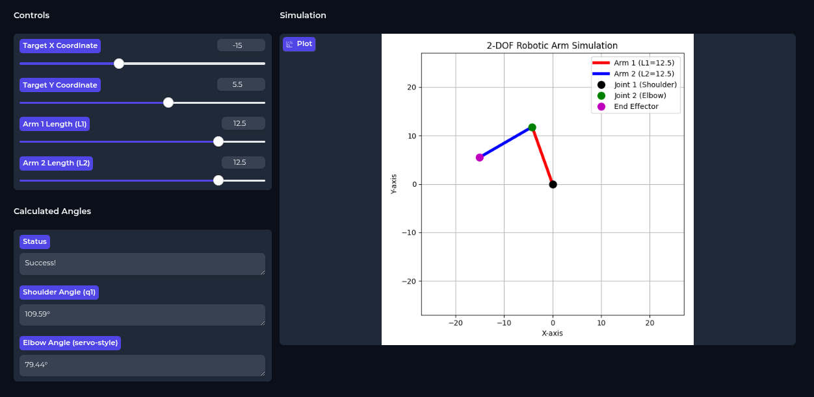

<!--
SEO: Interactive Arm Simulator, 2-DOF robotic arm, inverse kinematics, python gradio app, robotics education, interactive simulation, arm kinematics visualization, open source robotics tool, robot arm math, educational robotics, engineering demo, real-time robotics, STEM learning
Description: Interactive Arm Simulator is a Python Gradio app for simulating and visualizing the inverse kinematics of a 2-DOF robotic arm. Adjust controls, see real-time results, and learn the math behind robotic arms. Perfect for education, demos, and open source robotics projects.
-->


# Interactive Arm Simulator



A modern, interactive Gradio app for simulating the inverse kinematics of a 2-DOF (two-degree-of-freedom) robotic arm. Visualize, experiment, and learn the math behind robotic arm movement in real-time!

---

## 🚀 Features
- **Live Simulation:** Adjust target coordinates (X, Y) and arm lengths (L1, L2) with sliders and see the arm move instantly.
- **Visual Feedback:** Clear visualization of the arm, joints, and unreachable targets.
- **Angle Display:** See calculated joint angles (shoulder and elbow) in both radians and degrees.
- **Math Explanation:** Built-in accordion explains the inverse kinematics formulas.
- **Copyable Python Code:** Easily grab the core function to use in your own projects.

---

## 🕹️ Controls Preview

*Use the sliders to set the arm lengths and target position. The plot updates in real-time.*

---

## 📦 Usage
1. **Install requirements:**
   ```bash
   pip install gradio matplotlib numpy
   ```
2. **Run the app:**
   ```bash
   python app.py
   ```
3. **Interact:**
   - Move the sliders for X, Y, L1, and L2.
   - Watch the arm and joint angles update.
   - Use the "Copy the Core Python Function" dropdown for your own code.

---

## 🧮 How It Works: Inverse Kinematics
This app calculates the joint angles needed for a 2-link arm to reach a target point (x, y) using geometry:

**1. Elbow Angle ($q_2$):**
Uses the Law of Cosines:
$$ \cos(q_2) = \frac{x^2 + y^2 - L_1^2 - L_2^2}{2L_1L_2} $$
**2. Shoulder Angle ($q_1$):**
Combines the angle to the target and the triangle's internal angle:
$$ q_1 = \alpha - \beta $$
Where:
- $\alpha = \text{atan2}(y, x)$ (angle to target)
- $\beta = \text{atan2}(L_2 \sin(q_2), L_1 + L_2 \cos(q_2))$
If the target is unreachable, the app shows a warning and marks it in red.
---
## 📝 Copy the Core Python Function
The app includes a dropdown with the following code for your use:
```python
def inver_k(l1, l2, x, y):
    """
    Calculates the joint angles (q1, q2) for a 2-DOF robotic arm.
    Args:
        l1, l2: Lengths of the arm segments
        x, y: Target coordinates
    Returns:
        (success, q1, q2): Whether the point is reachable and the joint angles in radians
    """
    import math
    import numpy as np
    dist_sq = x**2 + y**2
    if dist_sq > (l1 + l2)**2 or dist_sq < (l1 - l2)**2:
        return (False, 0, 0)
    cos_q2 = (dist_sq - l1**2 - l2**2) / (2 * l1 * l2)
    cos_q2 = np.clip(cos_q2, -1.0, 1.0)
    q2 = math.acos(cos_q2)
    alpha = math.atan2(y, x)
    beta = math.atan2(l2 * math.sin(q2), l1 + l2 * math.cos(q2))
    q1 = alpha - beta
    return (True, q1, q2)
```
---

## 📚 Credits
- Original inverse kinematics logic from [ARMv6 by gokul6350](https://github.com/gokul6350/ARMv6/blob/main/main_src/inverse_k.py)
- Adapted and extended as an interactive Gradio app for educational purposes.

---

## License
MIT